# Chef InProgress

Cooking food, for many, is a hard and complex task. Millions of people today who don’t know how to cook or what to cook, consider it a hassle to cook. Combine that with the limited ingredients they have in their inventory or their kitchen, it becomes a hard task to make a decent nutritious meal which also tastes good.

Considering the above problem, we have come up with a solution that will fulfil each and every need of the people. Chef InProgress is a food recipe recommender android mobile application that considers the existing kitchen inventory of the user while also tracking the nutritional intake of the user based on the dish he/she consumed.

## Features

* Recommend recipes based on user's inventory
* Cooking completion logging
* Favorite Recipes
* Kitchen/Fridge Inventory Management
* Adding ingredients by scanning shopping receipts or items
* Shopping List
* Nutrition intake tracking
* User account

### Login and Registration
Login or create a new account before using the app.

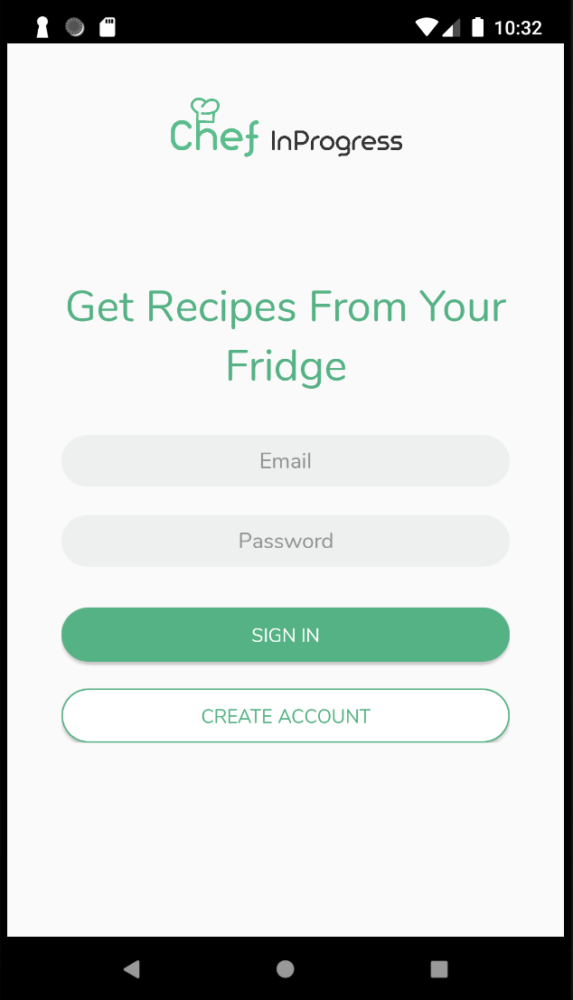 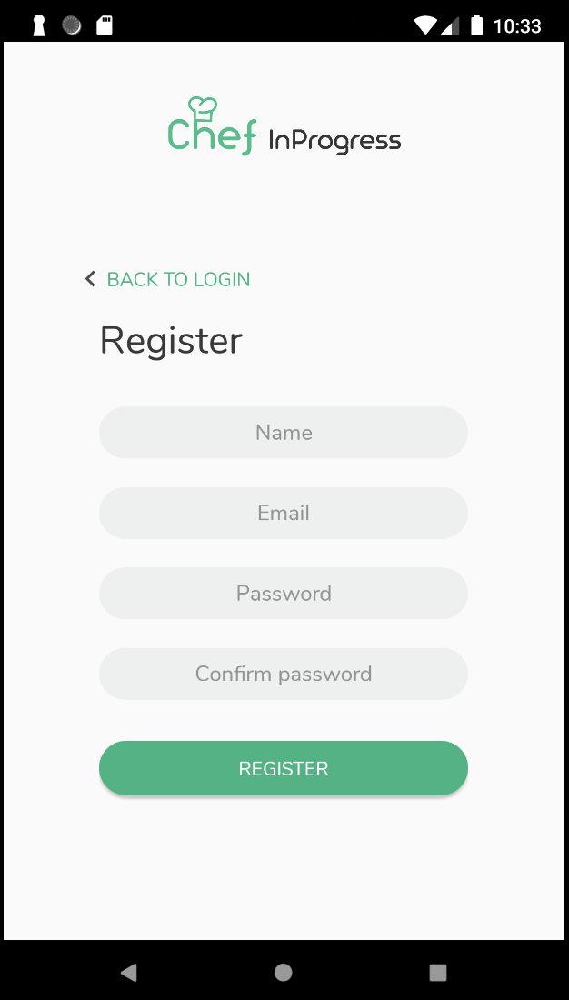

### Home page
View all the recipes you can make based on the ingredients you have in your inventory. You can also view other recipes in the 'All Recipes' view by tapping the toggle icon on the top right.

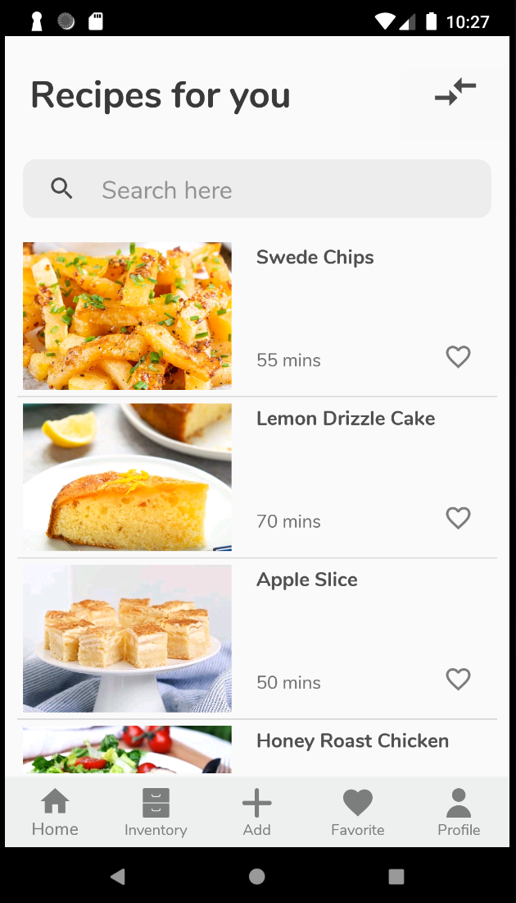 

In the recipe details screen, you can log recipe completion to record the nutrition intake.

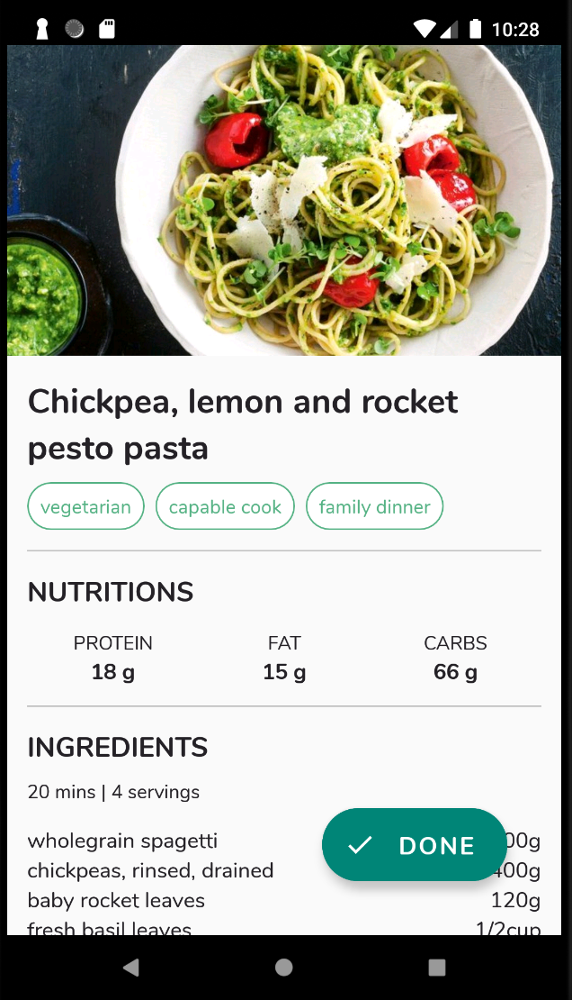

### Inventory & Shopping list
You can view your kitchen inventory and remove items from inventory here. Shopping list feature is also available for keeping tracking with ingredients you need to buy.

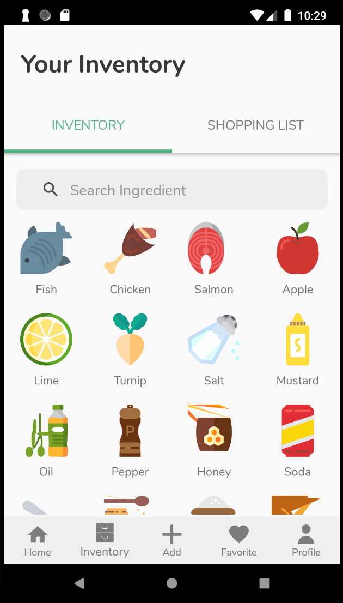 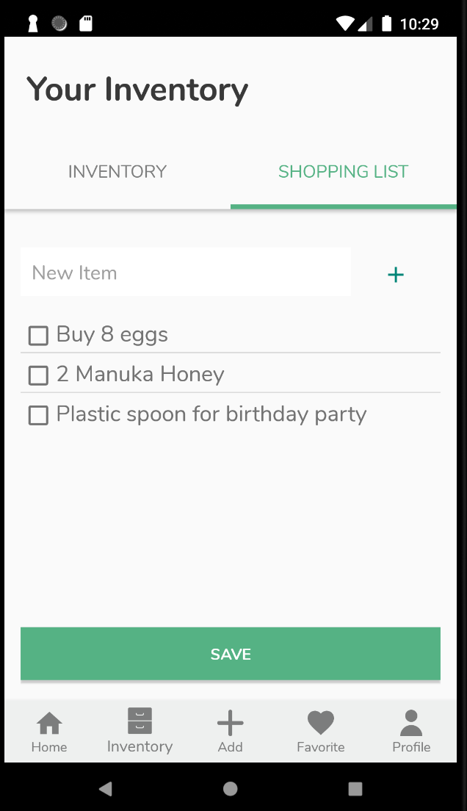

### Adding ingredients
Ingredients can be added manually,

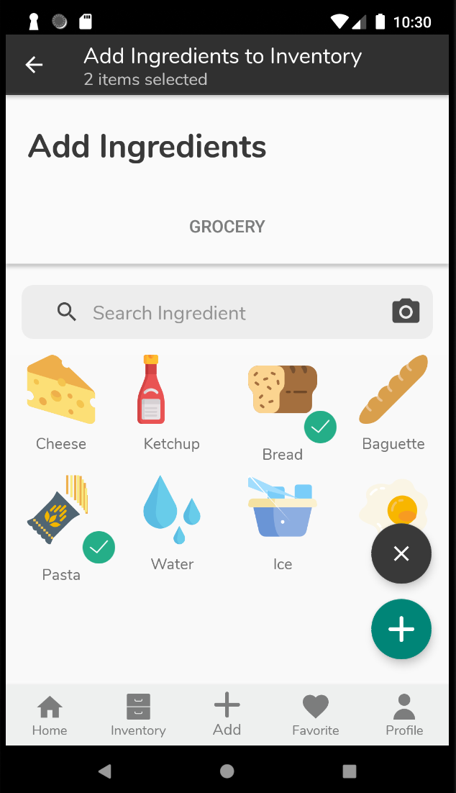

Or by scanning a shopping receipt or item to add automatically.

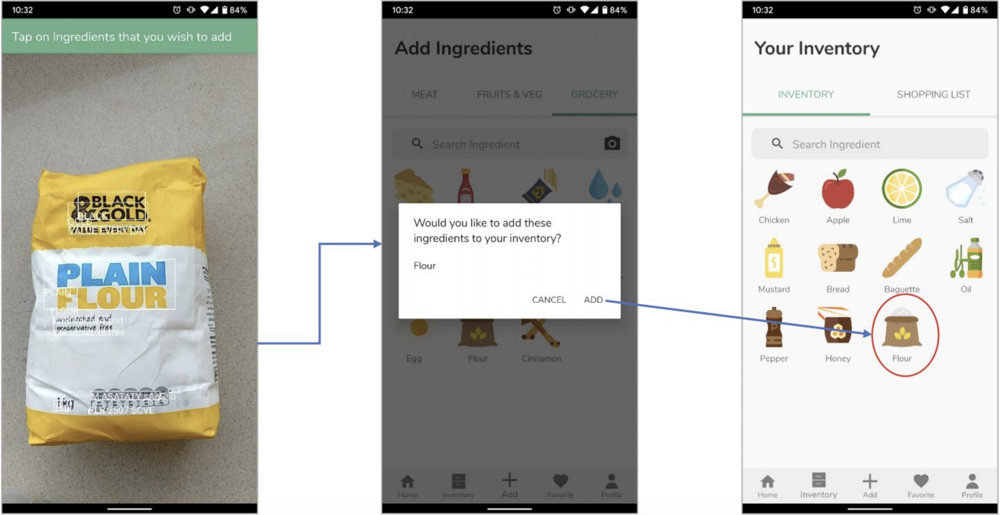

Google Mobile Vision Text API is used for implementing this feature to obtain ingredients' text from receipts of from the product itself. The API gives the application an ability to read text from the camera view

### Favorites
List of your favorite recipes can be viewed in the Favorite menu. Add and remove from favorites by tapping on the heart icon next to the recipe.

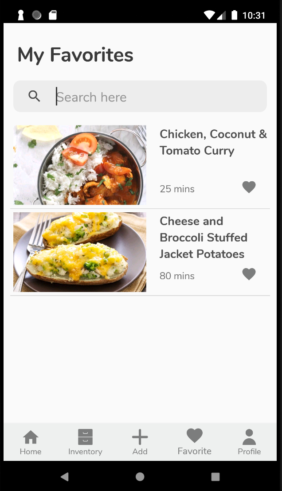

### Profile and Nutrition Tracking
View your profile and check nutrition intake and completed recipe by date.

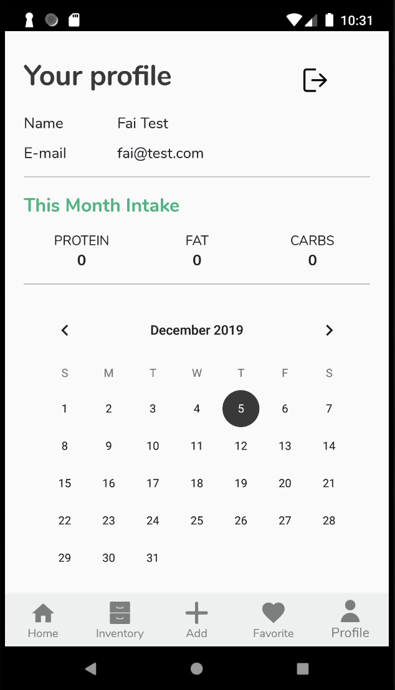 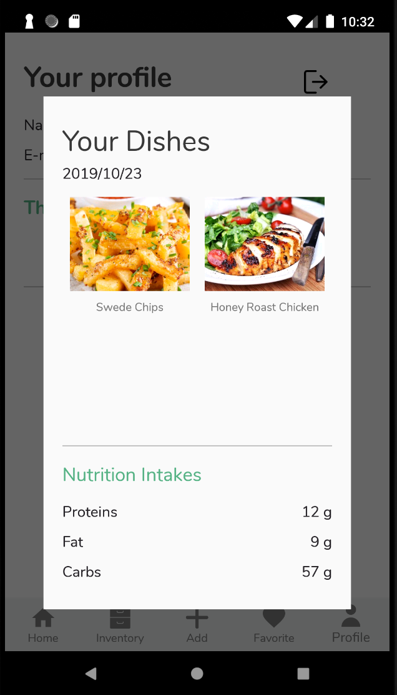

## Prerequisites

* Android SDK v23
* Build tools version 29.0.2 or above
* Android Support Repository

## Setup

This project use Gradle build system.

1. Clone or download this repository
2. Import the project to Android Studio
3. Build and run

## Technical Approaches

### User Authentication
* FirebaseUI Auth: email authentication

### Database Implementations
* **Cloud database**: we use Firebase realtime database to store User and Recipe data. The recipe data is always retrieved from Firebase and requires an internet connection to successfully obtain the data. The User data is only retrieved at the time that the application is launched. Once the user data is obtained from Firebase, the logged-in user data is saved to local storage.

* **Local database**: we use SQLiteOpenHelper to manage database transactions between the application and local device storage. The application’s ingredients data and logged-in user data is stored on the local device.

### Third party API
* Google Text Recognition API
* Styleable Toast
* Glide

## Notes
The project is forked from my University of Sydney Enterprise Github account.
